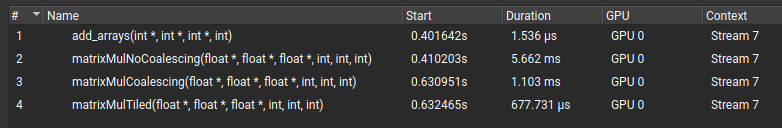

# Hardware-Acceleration-CUDA

## Matrix multiplications


## Furthest Point sampling

```
CPU Time for 1 point cloud: 450.66 ms
GPU Time for 1 Point cloud: 24.7958 ms
Speedup: 18.1749x
GPU Time for batch of 10 point clouds: 27.7871 ms
```

## CPU performance optimization - AVX

```
Dot product of 2 vectors of size 10000
Scalar took 217740 us
AVX Intrinsics took 67150 us
AVX Intrinsics with restrict took 49999 us
```